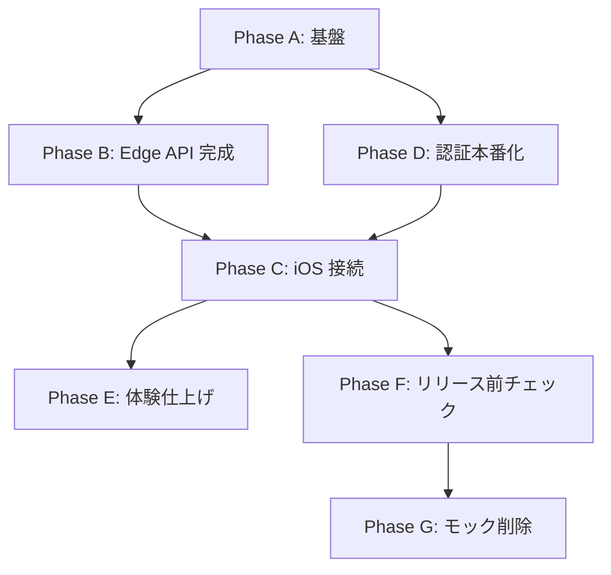

# 08. ロードマップと未決項目

要件の正本は `01`〜`13`（特に `09` / `10` / `11`）。本ファイルは **MVP までの実装ペース・残タスク・未決事項** を管理する。

---

## 現状サマリ（2026/06/19 時点）

| 領域 | 進捗 | 備考 |
|---|---|---|
| iOS UI（SwiftUI） | おおむね完成 | 全画面・Liquid Glass・共通状態 UI あり |
| iOS ↔ Edge 接続 | **main merge 済み・E2E 検証未** | C1〜C7 実装済み。**本番 API 動作確認は D1 後**（§Phase C 検証後回し） |
| Edge API | **Phase B 完了** | B0〜B7 実装・本番 smoke 通過（`plotty-api` デプロイ済み）。`main` に merge 済み |
| Supabase 運用 | Phase A/B コード完了 | B5/B7 migration 適用済み。A6 RLS migration は db push 待ち |
| 認証 | **Phase D 着手（D1 実装中）** | Google → Supabase session → `AccountSession` 接続。Apple / Email はモックのまま |

**ボトルネック:** Phase C の **E2E 検証**（要: 有効 JWT）。D1 完了後に §検証後回し の手順で実施可能。

**作業ブランチ:** Phase A は **`feature/phase-a-supabase-foundation`**（A3 以降も同一ブランチでコミット → Phase 完了後に PR）。

---

## インフラ方針（Edge / コスト）

### Edge とは（本プロダクトでの意味）

docs の **Edge** は「iOS と Supabase の間に立つ API サーバー」の総称。`06` / `10` の責務:

- Supabase JWT の検証
- Groq 呼び出し（API キーは Edge のみ保持）
- 暗号化 / 復号
- DB 読み書き（`service_role` は Edge 内のみ）

iOS は **Edge の HTTPS URL** に JSON でリクエストするだけ（Web ブラウザ専用ではない）。

### Edge ランタイム: Supabase Edge Functions（確定）

**2026/06/03 決定:** Plotty の API 層は [Supabase Edge Functions](https://supabase.com/docs/guides/functions)（Deno）でホストする。Cloudflare Workers は不採用。

| 項目 | 内容 |
|---|---|
| 関数名（仮） | `plotty-api`（変更可。iOS の Base URL とセットで更新） |
| 公開 URL | `https://<project-ref>.supabase.co/functions/v1/plotty-api/...` |
| アプリ内パス | `/api/v1/chat/messages` 等（`10` §3 と同一契約） |
| ソース配置 | `supabase/functions/plotty-api/`（`edge/` のロジックを移植・統合） |
| 秘密情報 | Supabase Dashboard → Edge Functions Secrets（Groq キー、`service_role`、暗号鍵） |
| JWT | リクエスト `Authorization: Bearer <supabase_access_token>`。Function 内で検証 |

**Workers 形式からの差分（A4）:**

- 入口: `export default { fetch }` → `Deno.serve` + ルーター
- デプロイ: `supabase functions deploy plotty-api`
- ローカル: `supabase functions serve plotty-api`

`edge/` 配下の handler / contract / service は **可能な限りそのまま再利用** し、ランタイム adapter のみ差し替える。

### 無料枠で収めるための前提（2026 年時点の目安）

MVP は **個人〜小規模利用** を想定し、以下で設計する。公式 limit は変更され得るため、リリース前に各ダッシュボードで再確認する。

| サービス | 無料枠の目安 | Plotty での用途 | 注意 |
|---|---|---|---|
| **Supabase（全体）** | Free プロジェクト | Auth、DB、RLS、Edge Functions | **1 週間無操作で pause**（データは保持、手動 resume 可） |
| **Supabase Edge Functions** | 50 万 invocations / 月 | API 本体 | CPU **2s / req**（I/O 除く）。低利用なら十分 |
| **Groq** | 無料クレジット / レート制限あり | LLM 抽出 | **コストの主因**。B7 の日次トークン上限とセット |
| **Apple Developer** | 登録済み（コスト懸念外） | App Store / TestFlight 配布 | — |

**Supabase Edge Functions で特に気をつける点:**

- **プロジェクト pause:** 個人利用で長期未使用時に API が止まる。必要なら週次 ping または手動 resume（`08` 意思決定ログ参照）。
- **レート制限:** in-memory のみではインスタンス跨ぎで抜ける。**日次トークン集計は Postgres テーブル**（`05` §利用量制限）。
- **鍵管理:** MVP は Edge Functions Secrets + 環境変数。docs の Vault 参照は将来拡張。

**コスト方針:**

- MVP: **Supabase Free + Groq 無料枠**（追加 PaaS アカウント不要）
- Groq 超過リスク: user 日次トークン上限 → dev 用 8B モデル → 上限引き下げ
- App Store: Developer 登録済み
- Groq 日次上限: 初期 50k tokens / user / day（`05` §利用量制限）

---

## ブランチ命名

README の `feature/<category>-<topic>` に従う。**1 Phase 1 ブランチ**。Phase 内のタスク（A1, B3 等）は **同一ブランチ上で順にコミット**し、**Phase の完了条件を満たしたタイミングで PR → merge** する。作業前に `main` を最新化する。

| Phase | ブランチ | PR タイミング |
|---|---|---|
| A | `feature/phase-a-supabase-foundation` | A1〜A6 完了・完了条件達成後 |
| B | `feature/phase-b-edge-api` | B1〜B7 完了後 |
| C | `feature/phase-c-ios-edge-connection` | C1〜C7 **コード完了**後（**E2E 検証は D1 後**。検証完了まで PR merge しない） |
| D | `feature/phase-d-auth-production` | D1〜D8 完了後 |
| E | `feature/phase-e-ux-polish` | E1〜E5 完了後 |
| F | `feature/phase-f-release-gate` | `11` §6 全項目クリア後 |
| G | `clean/phase-g-mock-removal` | モック削除・整理完了後 |

| category の目安 | 用途 |
|---|---|
| `feature/` | Phase 単位の機能・接続（上表） |
| `fix/` | リリース前の単発修正（Phase F 中でも可） |
| `docs/` | ドキュメントのみ |
| `clean/` | Phase G のモック削除 |

**コミット:** Phase 内は **タスク完了ごとに 1 コミット**（例: `add: A3 messages 30日削除 cron migration`）。**push / PR は Phase 完了時**。

**レガシー:** タスク単位ブランチ（`feature/supabase-schema-migration` 等）で着手済みの場合は、未 merge 分を Phase ブランチに cherry-pick するか、Phase ブランチを切り直して `main` から再開してよい。

---

## MVP 実装ペース（推奨順序）

依存関係を踏まえ、以下の Phase 順で進める。各 Phase 完了時に「動作確認できる単位」を設ける。



### Phase A — 基盤（Supabase + Edge デプロイ）

**ブランチ:** `feature/phase-a-supabase-foundation`

**目的:** 本番相当の DB・API 実行環境を用意する。

| # | タスク | 状態 | 参照 |
|---|---|---|---|
| A1 | `edge/sql/plotty_schema.sql` を Supabase migration として適用 | **完了** | `13` |
| A2 | `auth.users` → `public.users` 自動作成トリガーを適用 | **完了** | `04`, `09`, `13` |
| A3 | `messages` 30 日削除 cron（`edge/sql/messages-retention-job.sql`） | **完了** | `02`, `07` |
| A4 | `edge/` を Supabase Edge Function（`plotty-api`）としてデプロイ。Secrets 設定 | **完了** | `05`, `06`, `09` §10, 本ファイル §A4 デプロイ |
| A5 | iOS に Edge Base URL を設定（`.../functions/v1/plotty-api`） | **完了** | `06`, `10` §3, `SupabaseConfig` |
| A6 | RLS を migration 化し、本番と開発で同一手順にする | **コード完了** / db push 待ち | `07`, `13`, `edge/sql/rls-policies.sql` |

**完了条件:** curl / 統合テストで JWT 付き `POST /api/v1/chat/messages` が本番 DB に書き込める。

**推奨作業順:** A1 → A2 → A6 → A3 → A4 → A5（A1/A2/A6 は依存が強いため連続作業可）

#### A4 デプロイ手順

配置: `supabase/functions/plotty-api/index.ts` + `_shared/plotty-edge/`（`edge/src` のコピー）。

1. **Secrets 登録**（初回・更新時。`SUPABASE_URL` / `SUPABASE_SERVICE_ROLE_KEY` はホスト側でも注入されるが、`.env.local` 全体で揃える）
   ```bash
   supabase secrets set --env-file supabase/.env.local
   ```
2. **デプロイ**
   ```bash
   supabase functions deploy plotty-api
   ```
3. **ローカル確認**
   ```bash
   supabase functions serve plotty-api --env-file supabase/.env.local
   ```
4. **`edge/src` 変更後** — `_shared` を再同期（`supabase/functions/_shared/README.md` 参照）

**公開 URL 例:** `https://<project-ref>.supabase.co/functions/v1/plotty-api/api/v1/chat/messages`

---

### Phase B — Edge API 完成

**ブランチ:** `feature/phase-b-edge-api`

**目的:** `06` / `10` に記載の MVP エンドポイントをコードと契約で揃える。

| # | タスク | 状態 | 参照 |
|---|---|---|---|
| B1 | `POST /api/v1/chat/reclassify` 実装 + router 登録 | **完了** | `06`, `10` §3.2, `contracts/api-contract-mvp.md` §4 |
| B2 | 一覧 API を `GET /entities` に統一（種別 GET は MVP 不提供） | **完了** | `contracts/api-contract-mvp.md` §1 |
| B3 | PATCH / GET DTO を UI 必須フィールドまで拡張 | **完了** | `contracts/api-contract-mvp.md` §2 |
| B4 | 初回利用時の `encryption_key_id` 発行 | **完了** | `09` §5.2 |
| B5 | `client_message_id` 冪等の本番検証 | **完了** | `contracts/api-contract-mvp.md` §5 |
| B6 | Groq 障害時のエラーコード・文言を確定 | **完了** | `edge/src/services/groq-errors.ts` |
| B7 | Groq 日次トークン上限（user 単位、UTC 日次）+ 短時間 req 制限 | **完了** | `05` §利用量制限 |

**完了条件:** `edge/src/tests/integration.test.ts` に reclassify を追加し、本番 Supabase でも同等フローが通る。

**推奨作業順:** B2 → B3 → B1 → B4 → B5 → B6 → B7

---

### Phase C — iOS ↔ Edge 接続

**ブランチ:** `feature/phase-c-ios-edge-connection`

**目的:** モックデータをやめ、docs 通りのデータフローに切り替える。

| # | タスク | コード | 参照 |
|---|---|---|---|
| C1 | `PlotAPIClient` 新設（Bearer JWT、`request_id` エラー mapping） | ✅ | `06`, `10` |
| C2 | Edge DTO ↔ 各 Item / ChatMessage mapper | ✅ | `10` §4 |
| C3 | `PlotDataStore.reload()` → `GET /api/v1/entities` | ✅ | `02` §同期方針 |
| C4 | 編集・削除・完了切替・ピン留め → PATCH / DELETE | ✅ | `11` §3.4–3.6 |
| C5 | `ChatView` 送信 → `POST /api/v1/chat/messages` + Store 更新 | ✅ | `01`, `11` §3.7 |
| C6 | 再分類 → `POST /api/v1/chat/reclassify`（B1 完了後） | ✅ | `01`, `11` §3.7 |
| C7 | 送信ごとに `client_message_id`（UUID）を付与 | ✅ | `06` |

**完了条件（未達）:** `11` §6 のチェック 5（チャット → 実体作成 → 各一覧反映）が **本番 API で一連確認できる**こと。

**推奨作業順:** C1 → C2 → C3 → C4 → C5 + C7（同一コミット可）→ C6

#### 検証後回し（2026/06/19 決定）

C1〜C7 の **iOS コード実装は完了**したが、本番 API に対する **動作確認（Plan A スモーク）は意図的に未実施**とする。Phase D 着手を優先し、検証は後段でまとめて行う。

| 項目 | 内容 |
|---|---|
| **未実施の確認** | `11` §6 チェック 5（チャット送信 → 各一覧反映）、C4 の PATCH 永続化、C6 再分類、C7 冪等再送 |
| **実施タイミング** | **Phase D 最小（D1: Google → Supabase session、`demoLaunchToChat` 廃止）の直後**。その前は `PlotDebug.demoLaunchToChat = true` のため JWT がなく API 検証が成立しない |
| **PR / merge** | コードは `feature/phase-c-ios-edge-connection` に残す。**E2E 検証完了まで `main` へ merge しない** |
| **本番 Edge** | `main` に Phase B merge 済み（reclassify・拡張 PATCH・冪等）。本番 deploy 版も B 相当であること |

**検証時のスモーク手順（メモ）:**

1. `PlotDebug.demoLaunchToChat = false`（D1 で恒久化予定）
2. Google でログイン（Supabase JWT 取得）
3. チャット送信 → ToDo / メモ / カレンダー各タブで反映確認
4. 必要に応じて編集・削除・再分類

**既知の未修正（検証時に確認）:**

| 項目 | 内容 | 優先 |
|---|---|---|
| タイムアウト再送 | サーバー成功 + クライアント 10s タイムアウト後の再送で **AI メッセージが二重表示**しうる（`message_id` dedupe 未実装） | 検証で再現したら修正 |
| 手動作成（＋ボタン） | ローカルのみ。reload 後に消える / PATCH・DELETE は `NOT_FOUND` | Phase C スコープ外。Phase E 以降または別タスク |
| PATCH 一部フィールド | iOS は `is_completed` / `is_pinned` 等を送るが、**deploy 中の Edge が未対応版だとサーバーに反映されない** | B deploy 版で再確認 |
| `ChatMockResponder.swift` | 未参照の dead code | Phase G で削除可 |

---

### Phase D — 認証本番化

**ブランチ:** `feature/phase-d-auth-production`

**目的:** `04` / `11` §3.1–3.2 の 3 方式を Supabase Auth で通す。

| # | タスク | 参照 | 状態 |
|---|---|---|---|
| D1 | Google OAuth 成功 → Supabase session → `AccountSession`（samples 廃止） | `04` | ✅ コード完了（実機 OAuth 要確認） |
| D2 | Sign in with Apple | `04` | 未着手 |
| D3 | Email をマジックリンク / OTP に変更 | `04`, `11` §3.1 | 未着手 |
| D4 | 前回ログイン方式の推奨表示 | `04` §Apple Relay | 未着手 |
| D5 | Apple Relay 時のヘルプ誘導（Login → Help 連携） | `11` §3.1 | 未着手 |
| D6 | 新規登録時タイムゾーンを端末 → `public.users.timezone` | `11` §3.2 | 未着手 |
| D7 | ログアウト / アカウント削除を Supabase + DB に接続 | `11` §3.3 | 未着手 |
| D8 | `PlotDebug` デモフラグを本番ビルドから除外 | — | 未着手 |

**完了条件:** `11` §6 のチェック 2・3 が通る。

**推奨作業順:** D1 → D2 → D3 → D4 → D5 → D6 → D7 → D8

**メモ:** Phase C と並行可能だが、**C1 以降は有効 JWT が必要**なため **実機 E2E は D1 完了後**に Phase C §検証後回し の手順で行う（C5 実装自体は JWT なしでは動作しない）。

---

### Phase E — 体験仕上げ

**ブランチ:** `feature/phase-e-ux-polish`

**目的:** UI シェルだけでは足りない docs 要件を埋める。

| # | タスク | 参照 |
|---|---|---|
| E1 | `ai_persona_config` / `timezone` / `display_name` を `public.users` と双方向同期 | `09` §3.2, `11` §3.3 |
| E2 | チャット履歴の取得・表示（必要なら Edge に messages GET を追加） | `11` §3.7 |
| E3 | AI 推論アシスト UI（500ms デバウンス、キー入力ごとの API 呼び出し禁止） | `01`, `09` §1.2 |
| E4 | 元メッセージ 30 日経過後の再分類不可 | `01`, `09` §1.2 |
| E5 | 主要イベント計測 + 失敗時 `request_id` 連携 | `11` §2.4 |

**完了条件:** `11` §6 のチェック 6 が通る。

**推奨作業順:** E1 → E2 → E3 → E4 → E5

---

### Phase F — リリース前チェック

**ブランチ:** `feature/phase-f-release-gate`

`11` §6 を正本として全項目を確認する。チェックで見つかった単発修正は **同一 Phase F ブランチ**で対応する。緊急の hotfix のみ `fix/*` を許容。

| チェック | 対応 Phase / タスク |
|---|---|
| 1. 法務画面の全導線 | Phase F 内で修正 |
| 2. 認証 3 方式 | Phase D |
| 3. Apple Relay 導線 | Phase D（D5） |
| 4. 共通 UI 状態 | Phase F 内で修正 |
| 5. チャット → 一覧の一連 | Phase C（**コード済み・E2E 未**。D1 後に §検証後回し 参照） |
| 6. 設定反映 | Phase E（E1） |
| OSS ライセンス本文 | Phase F 内（E 相当の残タスク） |

---

### Phase G — モック削除・整理

**ブランチ:** `clean/phase-g-mock-removal`

| 対象 | 備考 |
|---|---|
| `ChatMockResponder` / `*.sampleData` / `PlottyAccount.samples` | Phase G で一括削除 |
| `PlotDebug` デモ用フラグ | Phase G または Phase D（D8）と重複しないよう整理 |
| `SupabaseDatabaseService` stub 整理 | Phase G |
| `Plotty/Core/` 重複ファイル | Phase G |

---

## 実装順序の理由（要約）

| 順 | Phase | 理由 |
|---|---|---|
| 1 | A | API も iOS も DB がないと何も検証できない |
| 2 | B | iOS 接続前に Edge 契約・reclassify を固める |
| 3 | D（D1 優先） | JWT がないと Edge を呼べない |
| 4 | C | 一覧 CRUD → チャット → 再分類の順がデバッグしやすい |
| 5 | E | 接続後に UX 要件（履歴・推論 UI・設定同期）を仕上げる |
| 6 | F | リリースゲート |
| 7 | G | モック削除は接続完了後でよい |

---

## コードと docs のズレ（docs 準拠で解消する）

解消は **該当 Phase ブランチ**内で行う。

| 項目 | docs | 現コード | 解消 Phase |
|---|---|---|---|
| Email 認証 | マジックリンク / OTP | パスワードフォーム | D（D3） |
| 種別 GET | `/schedules` 等 | **`GET /entities` のみ**（確定） | B（B3） |
| PATCH / GET フィールド | UI 必須フィールド | 契約未反映 | B（B3） |
| Edge ランタイム | Supabase Edge Functions | `edge/` が Workers 形式 | A（A4） |
| チャット履歴 | `messages` 表示 | セッション内メモリのみ | E（E2） |
| AI 推論アシスト | 入力中 UI | 未実装 | E（E3） |
| OSS ライセンス | 利用ライブラリ一覧 | プレースホルダー | F |

---

## Phase 2 候補（MVP 外）

| 内容 | ブランチ例（着手時） |
|---|---|
| OS 標準カレンダー連携 | `feature/ios-eventkit-calendar-sync` |
| プッシュ通知 | `feature/ios-push-notifications` |
| 別メールアカウントの手動統合 UI | `feature/account-manual-link-ui` |

---

## 追加で詰める項目（未決）

- Groq 障害時の UX（文言、再試行導線）→ Phase B（B6）完了。UI 再試行導線は Phase E（E5）
- Groq 日次トークン上限の実装・初期値チューニング → Phase B（B7）**完了**（`GROQ_DAILY_TOKEN_LIMIT` env、本番 smoke 済み）
- `messages.client_message_id` 列 → Phase B（B5）**完了**（`20260608100000_messages_client_message_id.sql` 適用済み）

---

## 実装メモ（施工待ち・方針変更なし）

設計は確定。コード / migration / mapper で吸収する項目の一覧は **`docs/contracts/implementation-notes.md`** を正本とする。

含む内容:

- ドキュメント正本の整理（`design.md` / `phase-0-api-contract.json` 等）
- API ↔ iOS mapper（priority 1–3、due_date デフォルト、accent 非永続）
- Migration バックログ（`client_message_id`、`user_daily_groq_usage`）
- Phase E 以降に回す項目
- インフラ運用メモ（Supabase pause 等）

---

## 意思決定ログ（追記用）

- 2026/06/03: App Store 配布は Apple Developer 登録済みのためインフラコスト懸念から除外。
- 2026/06/03: Groq は **user 単位・1日・トークン上限** を Edge で enforce する（初期 50,000 tokens / user / day、UTC リセット）。Plotty は大量利用を求めないが、コスト暴走防止の安全弁として設ける。値は env で調整し、Groq ダッシュボードを見ながら後から厳しくしてよい。
- 2026/06/03: Edge ランタイムは **Supabase Edge Functions** に確定（Cloudflare Workers は不採用）。理由: Supabase スタック統一、CPU 2s/req で暗号処理に余裕、日次トークン集計を同一 DB で扱いやすい。トレードオフ: Free プロジェクトの 1 週間 pause、`edge/` の Deno 向け載せ替え（A4）。
- 2026/06/03: **一覧 API** は `GET /entities?type=` のみ（種別 GET は MVP 不提供）。`docs/contracts/api-contract-mvp.md` §1。
- 2026/06/03: **GET/PATCH DTO** を UI 必須フィールドまで確定（schedule: 日時・終日・場所・notes / task: 完了・期限・priority 1–3 / memo: content・pin）。`accent`/`swatch` は iOS のみ。§2。
- 2026/06/03: **`POST /chat/reclassify`** 契約確定（論理削除 + 新規作成、`migrated_entity` + `confirmation_text`）。§4。
- 2026/06/03: **`client_message_id` 冪等** — 同一 user+key の再 POST は **200 + 初回レスポンス**。§5。
- 2026/06/03: §2〜§4 の実装吸収項目・migration バックログ・doc 正本整理を **`docs/contracts/implementation-notes.md`** に集約。方針変更は不要、施工のみ。
- 2026/06/03: **設計レビュー結論** — MVP 設計は実装開始可能（完成度 約 80–85%、実装 約 15–20%）。priority / due_date / doc 正本のズレ・Phase E 後回しは **いずれも実装で吸収可能**（ユーザー確認済み）。docs push 後の次手: Phase A → B。
- 2026/06/07: **ブランチ戦略** — タスク単位（`feature/supabase-schema-migration` 等）から **Phase 単位 1 ブランチ**に変更。Phase 内はタスクごとにコミット、**push / PR は Phase 完了時**。Phase A ブランチ: `feature/phase-a-supabase-foundation`。
- 2026/06/19: **Phase C** — C1〜C7 の iOS コード実装を `feature/phase-c-ios-edge-connection` で完了。**本番 API 動作確認（Plan A スモーク）は D1 後に実施**とし、現時点では後回し。Phase C の PR merge は E2E 検証完了まで保留。詳細は本ファイル §Phase C「検証後回し」。
- 2026/06/03: **Phase D 着手** — D1: Google OAuth → Supabase session → `AccountSession` 接続、`PlottyAccount.samples` 廃止、`demoLaunchToChat = false`。ブランチ `feature/phase-d-auth-production`。
